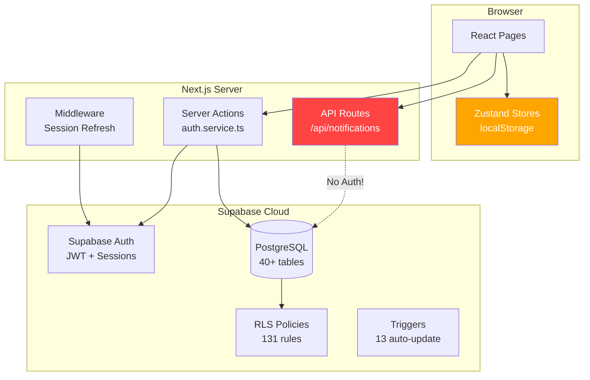

# NexHRMS — Comprehensive Improvement Audit

> **Generated:** 2025-06-22
> **Reviewed By:** Principal Engineer (Architect), Backend Architect, Lead Code Reviewer
> **Scope:** Full codebase — Supabase migrations, service layer, stores, frontend, security, tests
> **Current State:** 956/956 tests passing, 13 SQL migrations, dual-mode auth (demo + Supabase)

---

## Table of Contents

1. [Executive Summary](#1-executive-summary)
2. [Critical Issues (P0 — Fix Immediately)](#2-critical-issues-p0--fix-immediately)
3. [High Priority Issues (P1 — Fix Before Production)](#3-high-priority-issues-p1--fix-before-production)
4. [Medium Priority Issues (P2 — Fix During Sprint)](#4-medium-priority-issues-p2--fix-during-sprint)
5. [Low Priority / Nice-to-Have (P3)](#5-low-priority--nice-to-have-p3)
6. [Architecture Review (Architect Perspective)](#6-architecture-review-architect-perspective)
7. [Backend Architecture Review](#7-backend-architecture-review)
8. [Code Review Findings](#8-code-review-findings)
9. [SQL Migration Improvements](#9-sql-migration-improvements)
10. [Test Coverage Gaps](#10-test-coverage-gaps)
11. [Supabase Migration Gap Analysis](#11-supabase-migration-gap-analysis)
12. [Recommended Action Plan](#12-recommended-action-plan)

---

## 1. Executive Summary

NexHRMS is a well-structured Next.js 16 HRMS application with comprehensive domain coverage (attendance, payroll, leave, loans, tasks, messaging). The codebase has **strong test coverage for stores** (653 original + 303 backend tests) and a solid Supabase migration foundation (13 SQL migrations, idempotent triggers and policies).

However, the system is in a **critical transitional state** between client-only demo mode and a production Supabase backend. This audit identified **4 critical**, **9 high**, **12 medium**, and **6 low** priority issues across security, architecture, SQL schema, and test coverage.

### Key Metrics

| Metric | Current | Target |
|--------|---------|--------|
| Tests | 956 passing | 1200+ (add component, middleware, service, E2E) |
| Stores with tests | 10/19 (53%) | 19/19 (100%) |
| Service layer files | 1/10+ needed | All domains covered |
| Security headers | 0 configured | Full set (CSP, HSTS, etc.) |
| FK constraints coverage | ~40% of text refs | 100% |
| RLS policy quality | 127 policies, 4 overly-permissive | All policies properly scoped |

---

## 2. Critical Issues (P0 — Fix Immediately)

### C1. `createUserAccount()` Has No Authorization Check
- **File:** `src/services/auth.service.ts` (line ~66)
- **Severity:** `[Blocking]` — **CRITICAL**
- **Observation:** The server action uses `createAdminSupabaseClient()` (service role key, bypasses RLS) but performs **zero authorization verification** on the caller. Any authenticated user — including a regular employee — can invoke this server action to create admin accounts.
- **Impact:** Complete privilege escalation. A low-privilege user can create an admin account and take over the system.
- **Recommendation:**
```typescript
export async function createUserAccount(input: { ... }) {
  // Verify the caller is admin
  const supabase = await createServerSupabaseClient();
  const { data: { user } } = await supabase.auth.getUser();
  if (!user) return { ok: false as const, error: "Not authenticated" };

  const { data: profile } = await supabase
    .from("profiles")
    .select("role")
    .eq("id", user.id)
    .single();

  if (profile?.role !== "admin") {
    return { ok: false as const, error: "Unauthorized: Admin access required" };
  }

  // Now proceed with admin client
  const adminClient = await createAdminSupabaseClient();
  // ...
}
```

### C2. API Route `/api/notifications/resend` Has No Auth
- **File:** `src/app/api/notifications/resend/route.ts`
- **Severity:** `[Blocking]` — **CRITICAL**
- **Observation:** The POST endpoint has zero authentication or authorization. The middleware matcher explicitly excludes `api/notifications`, making this route completely open to the internet.
- **Impact:** Anyone can send notifications to any employee email, potentially for phishing or spam.
- **Recommendation:** Add Supabase session verification, or remove the middleware exclusion and add proper auth:
```typescript
import { createServerSupabaseClient } from "@/services/supabase-server";

export async function POST(request: Request) {
  const supabase = await createServerSupabaseClient();
  const { data: { user } } = await supabase.auth.getUser();
  if (!user) return Response.json({ error: "Unauthorized" }, { status: 401 });
  // ... rest of handler
}
```

### C3. Password "Hashing" Is Base64 Encoding (Demo Mode)
- **File:** `src/store/auth.store.ts` (lines 9–16)
- **Severity:** `[Blocking]` — **CRITICAL** if demo mode is ever used beyond development
- **Observation:** `hashPassword()` uses `btoa(encodeURIComponent(password))` — this is **trivially reversible** base64 encoding, not cryptographic hashing. All demo account passwords are stored in localStorage and viewable via browser DevTools.
- **Impact:** Any user can extract all account passwords from localStorage.
- **Recommendation:**
  - Add a prominent `// WARNING: Demo only — NOT cryptographically secure` banner
  - Add a runtime check: if `NEXT_PUBLIC_DEMO_MODE !== 'true'`, throw an error when `hashPassword()` or `verifyPassword()` are called
  - Ensure the login page cannot invoke local auth when demo mode is off

### C4. Overly-Permissive RLS INSERT Policies
- **File:** `supabase/migrations/011_rls_policies.sql`
- **Severity:** `[Blocking]` — **CRITICAL**
- **Observation:** Four INSERT policies use `WITH CHECK (true)`, meaning **any authenticated user** can insert rows:
  | Table | Policy | Risk |
  |-------|--------|------|
  | `attendance_events` | `ae_insert` | Any user can clock in/out for any employee |
  | `attendance_evidence` | `aev_insert` | Any user can attach evidence to any event |
  | `audit_logs` | `audit_insert` | Any user can inject fake audit records |
  | `notification_logs` | `nl_insert` | Any user can create fake notification logs |
- **Recommendation:** Restrict INSERT policies:
```sql
-- attendance_events: only own employee
CREATE POLICY ae_insert ON public.attendance_events
    FOR INSERT WITH CHECK (public.is_own_employee(employee_id));

-- audit_logs: service role only (remove the policy, use service_role key for inserts)
-- Or restrict to admin if client-side inserts are needed:
CREATE POLICY audit_insert ON public.audit_logs
    FOR INSERT WITH CHECK (public.get_user_role() IN ('admin', 'hr'));
```

---

## 3. High Priority Issues (P1 — Fix Before Production)

### H1. Missing Security Headers in `next.config.ts`
- **File:** `next.config.ts` (currently empty)
- **Impact:** Vulnerable to clickjacking (no X-Frame-Options), MIME type sniffing, missing HSTS
- **Recommendation:**
```typescript
const nextConfig: NextConfig = {
  async headers() {
    return [
      {
        source: "/(.*)",
        headers: [
          { key: "X-Frame-Options", value: "DENY" },
          { key: "X-Content-Type-Options", value: "nosniff" },
          { key: "Referrer-Policy", value: "strict-origin-when-cross-origin" },
          { key: "Permissions-Policy", value: "camera=(), microphone=(), geolocation=(self)" },
          { key: "Strict-Transport-Security", value: "max-age=31536000; includeSubDomains" },
        ],
      },
    ];
  },
};
```

### H2. Middleware Public Path Check Bypass
- **File:** `src/middleware.ts` (line 36)
- **Observation:** `publicPaths.some(p => pathname.startsWith(p))` — any path like `/loginadmin` or `/kiosk-secret-page` would bypass auth.
- **Recommendation:**
```typescript
const isPublic = publicPaths.some(
  (p) => request.nextUrl.pathname === p || request.nextUrl.pathname.startsWith(p + "/")
);
```

### H3. Dual Auth System Desync
- **Files:** `src/middleware.ts` + `src/app/client-layout.tsx`
- **Observation:** Middleware checks Supabase JWT session; `ClientLayout` checks Zustand `isAuthenticated`. These can desync:
  - User's Supabase session expires → middleware redirects to login → but Zustand still says authenticated
  - User manipulates localStorage `isAuthenticated: true` → client-layout allows access → but middleware blocks
- **Recommendation:** When Supabase mode is active, `ClientLayout` should validate against Supabase session (e.g., call `getCurrentUser()` on mount), not just Zustand state. Or unify: always trust the middleware and remove the client-side guard.

### H4. Role Switcher in Topbar (Production Leak)
- **File:** `src/components/shell/topbar.tsx` (lines 51–80)
- **Observation:** The role-switch dropdown allows changing roles without re-authentication. While labeled "(Demo)", the code runs in all environments and imports `DEMO_USERS` into the production bundle.
- **Recommendation:** Gate behind `NEXT_PUBLIC_DEMO_MODE`:
```typescript
{process.env.NEXT_PUBLIC_DEMO_MODE === 'true' && (
  <RoleSwitcherDropdown />
)}
```

### H5. ~30+ Text Reference Columns Lack FK Constraints
- **Files:** Multiple migration files (001–010)
- **Observation:** The majority of `text`-typed cross-table reference columns have no foreign key constraints. This includes `employee_id` in `location_pings`, `break_records`, `site_survey_photos`, `task_completion_reports`, `task_comments`, `channel_messages`, `notification_logs`; and `project_id`, `reviewed_by`, `approved_by`, `created_by` across many tables.
- **Impact:** Orphan records accumulate when referenced entities are deleted. No referential integrity enforcement at the DB level.
- **Recommendation:** Create migration `014_add_missing_fk_constraints.sql`:
```sql
-- High-priority FKs (employee_id references)
ALTER TABLE public.location_pings ADD CONSTRAINT fk_pings_employee
    FOREIGN KEY (employee_id) REFERENCES public.employees(id) ON DELETE CASCADE;
ALTER TABLE public.break_records ADD CONSTRAINT fk_breaks_employee
    FOREIGN KEY (employee_id) REFERENCES public.employees(id) ON DELETE CASCADE;
ALTER TABLE public.task_completion_reports ADD CONSTRAINT fk_tcr_employee
    FOREIGN KEY (employee_id) REFERENCES public.employees(id) ON DELETE CASCADE;
ALTER TABLE public.task_comments ADD CONSTRAINT fk_tc_employee
    FOREIGN KEY (employee_id) REFERENCES public.employees(id) ON DELETE CASCADE;
ALTER TABLE public.channel_messages ADD CONSTRAINT fk_cm_employee
    FOREIGN KEY (employee_id) REFERENCES public.employees(id) ON DELETE CASCADE;
ALTER TABLE public.notification_logs ADD CONSTRAINT fk_nl_employee
    FOREIGN KEY (employee_id) REFERENCES public.employees(id) ON DELETE CASCADE;
-- ... (full list in Section 9)
```

### H6. No `.env.example` File
- **Observation:** No `.env.example` exists to document required environment variables. Developers must reverse-engineer which env vars are needed from source code.
- **Recommendation:** Create `.env.example`:
```env
NEXT_PUBLIC_DEMO_MODE=true
NEXT_PUBLIC_SUPABASE_URL=https://your-project.supabase.co
NEXT_PUBLIC_SUPABASE_ANON_KEY=your-anon-key
SUPABASE_SERVICE_ROLE_KEY=your-service-role-key
```

### H7. No Env Validation
- **Files:** `src/services/supabase-browser.ts`, `src/services/supabase-server.ts`, `src/middleware.ts`
- **Observation:** Supabase URLs use `!` non-null assertion (`process.env.NEXT_PUBLIC_SUPABASE_URL!`), which crashes silently at runtime if the env var is missing. No startup validation.
- **Recommendation:** Add a validation utility:
```typescript
// src/lib/env.ts
function requireEnv(name: string): string {
  const value = process.env[name];
  if (!value) throw new Error(`Missing required env var: ${name}`);
  return value;
}

export const env = {
  supabaseUrl: requireEnv("NEXT_PUBLIC_SUPABASE_URL"),
  supabaseAnonKey: requireEnv("NEXT_PUBLIC_SUPABASE_ANON_KEY"),
};
```

### H8. `announcements` and `task_comments` SELECT Policies Too Broad
- **File:** `supabase/migrations/011_rls_policies.sql`
- **Observation:** `ann_read` and `tc_read` both use `USING (true)` — all announcements (including scoped ones) and all task comments are visible to every authenticated user, even if they're not in the target group.
- **Recommendation:** Scope announcements:
```sql
CREATE POLICY ann_read ON public.announcements
    FOR SELECT USING (
        scope = 'all_employees'
        OR (scope = 'selected_employees' AND EXISTS (
            SELECT 1 FROM employees e WHERE e.profile_id = auth.uid()
            AND e.id = ANY(announcements.target_employee_ids)
        ))
        OR public.is_admin_or_hr()
    );
```

### H9. No Password Complexity Enforcement in `createUserAccount()`
- **File:** `src/services/auth.service.ts` (lines 63–73)
- **Observation:** No minimum length, complexity, or common-password checks on the password parameter.
- **Recommendation:** Add validation before calling Supabase:
```typescript
if (input.password.length < 8) {
  return { ok: false as const, error: "Password must be at least 8 characters" };
}
```

---

## 4. Medium Priority Issues (P2 — Fix During Sprint)

### M1. Missing Composite Indexes for Common Query Patterns
- **Files:** Multiple migration files
- **Queries affected:**

| Table | Suggested Index | Use Case |
|-------|----------------|----------|
| `attendance_events` | `(employee_id, timestamp_utc)` | Date-range attendance queries per employee |
| `leave_requests` | `(employee_id, start_date, end_date)` | Leave overlap detection |
| `payslips` | `payroll_batch_id` | Fetch all payslips in a payroll run |
| `loan_deductions` | `payslip_id` | Join deductions to payslips |
| `location_pings` | `(employee_id, timestamp)` | GPS history per employee |
| `timesheets` | `status` | Filter by approval status |
| `notification_logs` | `sent_at` | Time-range notification queries |

### M2. `attendance_logs.check_in`/`check_out` Are `text` Instead of `timestamptz`
- **File:** `supabase/migrations/004_attendance.sql` (lines 72–73)
- **Impact:** Time comparisons in SQL are string-based, which is unreliable. Cannot use `BETWEEN`, `>`, `<` operators correctly on text-formatted times.
- **Recommendation:** Change to `timestamptz` or `time` type. If backward compatibility is needed, add computed columns.

### M3. `employees.role` Has No CHECK Constraint
- **File:** `supabase/migrations/002_employees.sql` (line 10)
- **Observation:** `profiles.role` has a CHECK constraint with 7 valid values, but `employees.role` accepts any string. These can drift.
- **Recommendation:**
```sql
ALTER TABLE public.employees ADD CONSTRAINT employees_role_check
    CHECK (role IN ('Admin','HR Admin','Finance','Employee','Supervisor','Payroll Admin','Auditor'));
```

### M4. `employees.pin` Stored as Plaintext
- **File:** `supabase/migrations/002_employees.sql` (line 25)
- **Observation:** Kiosk PINs are stored in plain text. If the database is compromised, all PINs are exposed.
- **Recommendation:** Hash PINs using a one-way hash. Since PINs are short (4–6 digits), use bcrypt with a salt (Supabase has `pgcrypto`):
```sql
-- Store: crypt('123456', gen_salt('bf'))
-- Verify: pin_hash = crypt(input_pin, pin_hash)
```

### M5. ~30 Tables Lack `updated_at` Triggers
- **Files:** Multiple migration files
- **Observation:** Only ~10 tables out of 40+ have `updated_at` columns with auto-update triggers. Tables like `salary_change_requests`, `payslips`, `loans`, `tasks`, `announcements` are mutable but lack modification timestamps.
- **Impact:** No audit trail for when records were last modified.
- **Recommendation:** Create `014_add_missing_updated_at.sql` to add `updated_at` columns and triggers to mutable tables.

### M6. Cross-Store Coupling (Tasks → Audit → Notifications)
- **Files:** `src/store/tasks.store.ts`, `src/store/messaging.store.ts`
- **Observation:** Stores directly call `useAuditStore.getState().log()` and `useNotificationsStore.getState().addLog()`, creating tight coupling.
- **Recommendation:** Introduce an event bus pattern or move side-effects to service layer:
```typescript
// Instead of:
useAuditStore.getState().log("task_created", ...);

// Use a service:
import { logAuditEvent } from "@/services/audit.service";
await logAuditEvent("task_created", ...);
```

### M7. `is_own_employee()` RLS Performance Concern
- **File:** `supabase/migrations/011_rls_policies.sql` (lines 6–13)
- **Observation:** The `is_own_employee()` function executes a subquery on every RLS policy evaluation. It's called in ~40+ policies. For queries returning many rows, this is N subqueries.
- **Recommendation:** Consider caching the employee_id in `app_metadata` or using a materialized view. At minimum, ensure the `(profile_id)` index on employees exists (it does: `idx_employees_profile_id`).

### M8. localStorage as Database (Unbounded Growth)
- **Files:** All store files
- **Observation:** Attendance events (append-only), location pings, and audit logs grow without limit. localStorage has a 5–10MB cap per origin. Heavy usage will eventually hit this cap and cause data loss.
- **Recommendation:**
  - Add `maxEntries` caps to append-only stores (attendance events, audit logs, location pings)
  - Auto-purge entries older than N days in demo mode
  - In production mode, don't persist these to localStorage at all — fetch from Supabase

### M9. No Rate Limiting on Login
- **Files:** `src/app/login/page.tsx`, `src/services/auth.service.ts`
- **Observation:** Neither demo nor Supabase login paths have rate limiting. Unlimited brute-force attempts are possible.
- **Recommendation:** Implement client-side throttling (e.g., progressive delay after failed attempts) and rely on Supabase's built-in rate limiting for the production path.

### M10. Route Divergence Between Demo and Production
- **Files:** `src/app/login/page.tsx`, `src/app/page.tsx`
- **Observation:** Demo mode routes to `/${role}/dashboard` while Supabase mode routes to `/dashboard`. Different URL structures between environments.
- **Recommendation:** Unify routing. Use `/dashboard` for both modes, or `/${role}/dashboard` for both.

### M11. `Permission` Type Duplicated in Two Places
- **Files:** `src/types/index.ts`, `src/store/roles.store.ts`
- **Observation:** The `Permission` union type and the `ALL_PERMISSIONS` array must stay in sync manually. No compile-time enforcement.
- **Recommendation:** Derive the type from the array:
```typescript
export const ALL_PERMISSIONS = ["page:dashboard", "page:employees", ...] as const;
export type Permission = (typeof ALL_PERMISSIONS)[number];
```

### M12. SSS Deduction Calculation Is Approximate
- **File:** `src/lib/ph-deductions.ts`
- **Observation:** SSS computation uses `4.5% of salary credit` linear interpolation instead of the actual DOLE bracket table. Edge-case amounts could be off.
- **Recommendation:** Implement the full bracket lookup table for production accuracy.

---

## 5. Low Priority / Nice-to-Have (P3)

### L1. No Memoization on Computed Store Selectors
- **Files:** All store files
- **Observation:** Functions like `getFilteredEmployees()`, `getByEmployee()` recalculate on every render. For large datasets, this causes unnecessary recomputations.
- **Recommendation:** Use Zustand's `useShallow` or `useMemo` patterns for expensive derived state.

### L2. Full Store Hydration on Every Page Load
- **Observation:** All 18 persisted stores rehydrate from localStorage on mount, even if a page only needs 1–2 stores.
- **Recommendation:** Consider lazy hydration or code-splitting stores per route.

### L3. `setTimeout(500)` Simulated Delay in Demo Login
- **File:** `src/app/login/page.tsx`
- **Observation:** Demo login adds a fake 500ms delay to simulate network latency. Unnecessary.
- **Recommendation:** Remove the `setTimeout` or make it 0 in development.

### L4. Hardcoded 2026 PH Holidays
- **File:** `src/lib/constants.ts`, `supabase/migrations/012_seed_data.sql`
- **Observation:** Holidays are hardcoded for 2026. No admin UI to manage year-to-year holidays.
- **Recommendation:** Build an admin holiday management UI, or add a yearly seed migration process.

### L5. `DEMO_USERS` Imported in Production Bundle
- **File:** `src/components/shell/topbar.tsx`
- **Observation:** Demo user data is imported unconditionally, included in the production JavaScript bundle.
- **Recommendation:** Dynamic import behind `NEXT_PUBLIC_DEMO_MODE` check.

### L6. Missing `.env.example` and Env Documentation
- **Observation:** New developers must read source code to discover required environment variables.
- **Recommendation:** Create `.env.example` with all variables documented.

---

## 6. Architecture Review (Architect Perspective)

### 6.1 Summary
The system architecture is a **monolithic Next.js application** with a client-side Zustand state layer transitioning to a Supabase backend. The architecture is sound for an MVP but has critical seam issues at the auth boundary and service layer gaps.

### 6.2 Architectural Concerns

| # | Severity | Concern | Implication | Recommendation |
|---|----------|---------|-------------|----------------|
| A1 | **Critical** | **Missing service layer** — Only `auth.service.ts` exists. All other domains (employees, attendance, payroll, etc.) have no server-side service. | Migrating from localStorage to Supabase requires building ~10 service modules from scratch. Business logic is trapped in client-side stores. | Prioritize building service files for P0–P3 domains. Follow the pattern in `auth.service.ts`. |
| A2 | **Critical** | **Dual auth systems** — Middleware checks Supabase JWT; ClientLayout checks Zustand `isAuthenticated`. | Auth states can diverge, leading to security holes or broken UX. | Unify: in production mode, derive `isAuthenticated` from Supabase session. |
| A3 | **Major** | **No data validation layer** — No Zod, yup, or similar schema validation between client and server. | Invalid data can be written to Supabase. Type safety only exists at compile time. | Add Zod schemas for all service input/output boundaries. |
| A4 | **Major** | **localStorage as primary database** — All HRMS data (employee records, payroll, attendance) persists only in the user's browser in demo mode. | Data is lost on browser clear. Cannot be used for multi-user or multi-device scenarios. | Accelerate Supabase service layer migration. |
| A5 | **Minor** | **No error boundary** — No React Error Boundary components to catch rendering failures. | An error in one component can crash the entire page. | Add error boundaries around page sections. |

### 6.3 Architectural Decision Record (ADR) Prompt
> **ADR: Unified Auth Strategy for Demo ↔ Production Modes**
> - Context: The system supports dual auth (localStorage demo + Supabase production). These systems use different session truth sources.
> - Decision Needed: Should we (a) unify on Supabase for all modes with a local Supabase instance for dev, (b) keep dual mode but unify the truth source, or (c) deprecate demo mode entirely?
> - Consequences to evaluate: Developer experience, test compatibility, deployment complexity.

### 6.4 Final Recommendation
**Request Changes** — The critical security issues (C1–C4) and missing service layer (A1) must be addressed before any production deployment.

---

## 7. Backend Architecture Review

### 7.1 Architecture Diagram



### 7.2 Schema Quality Assessment

| Category | Score | Notes |
|----------|-------|-------|
| Table design | ★★★★☆ | Comprehensive coverage but some type mismatches |
| FK constraints | ★★☆☆☆ | ~40% of text refs lack FKs |
| Indexes | ★★★☆☆ | Primary indexes good; missing composites |
| RLS policies | ★★★☆☆ | Good coverage but 4 overly-permissive INSERTs |
| Triggers | ★★★★☆ | Auto-update triggers work; many tables missing them |
| Seed data | ★★★★★ | Idempotent, ON CONFLICT DO NOTHING |
| Idempotency | ★★★★★ | All CREATE TABLE/TRIGGER/POLICY safely re-runnable |

### 7.3 Missing Database Objects

1. **Database functions for business logic:**
   - `compute_daily_timesheet(employee_id, date)` — reduce client-side computation
   - `check_leave_overlap(employee_id, start_date, end_date)` — atomic overlap detection
   - `process_loan_deduction(loan_id, payslip_id, amount)` — transactional deduction

2. **Database views for common queries:**
   - `v_employee_attendance_summary` — joins employees ↔ attendance_logs ↔ timesheets
   - `v_payroll_run_totals` — aggregated payroll run statistics
   - `v_leave_balance_overview` — current leave balances per employee

3. **Missing Supabase Realtime subscriptions** — No real-time features configured. For tasks, messaging, and notifications, real-time would significantly improve UX.

---

## 8. Code Review Findings

### 8.1 Service Layer

| # | Severity | File | Observation | Suggestion |
|---|----------|------|-------------|------------|
| CR1 | `[Blocking]` | `auth.service.ts:66` | `createUserAccount()` has no caller authorization | Add role check before admin operations (see C1) |
| CR2 | `[Suggestion]` | `auth.service.ts:11` | `signIn()` returns raw Supabase error messages to client | Sanitize error messages — don't leak internal details |
| CR3 | `[Suggestion]` | `auth.service.ts:18-30` | `signIn()` makes 3 sequential queries (auth → profile → employee) | Consider a database view or function to fetch in one call |
| CR4 | `[Suggestion]` | `supabase-server.ts:22` | Silent `catch` on cookie `setAll` could mask issues | Add `console.warn` in development mode |

### 8.2 Middleware

| # | Severity | File | Observation | Suggestion |
|---|----------|------|-------------|------------|
| CR5 | `[Blocking]` | `middleware.ts:36` | `startsWith` path check allows bypass | Use exact match or check for `/` separator (see H2) |
| CR6 | `[Suggestion]` | `middleware.ts:46` | Authenticated users redirected to `/dashboard` always | Should respect role-based URLs: `/${role}/dashboard` |

### 8.3 Login Page

| # | Severity | File | Observation | Suggestion |
|---|----------|------|-------------|------------|
| CR7 | `[Suggestion]` | `login/page.tsx` | Demo mode flag is a client env var — visible in page source | For security, consider server-side rendering the login page to hide the flag |
| CR8 | `[Question]` | `login/page.tsx` | Quick-login buttons expose the demo password `"demo1234"` in client code | Is this acceptable for the deployed demo environment? |

### 8.4 Store Patterns

| # | Severity | File | Observation | Suggestion |
|---|----------|------|-------------|------------|
| CR9 | `[Suggestion]` | All stores | `Employee.role` is typed as `string` instead of `Role` | Use the `Role` union type for compile-time safety |
| CR10 | `[Suggestion]` | `attendance.store.ts` | Append-only event ledger has no size cap | Add `MAX_EVENTS` constant and trim oldest entries |
| CR11 | `[Suggestion]` | `payroll.store.ts` | Very large file (~800+ lines) with multiple responsibilities | Consider splitting: payroll-runs, payslips, adjustments, final-pay |

---

## 9. SQL Migration Improvements

### 9.1 Full FK Constraint Gap List

Create `014_add_missing_fk_constraints.sql`:

```sql
-- ═══ Employee ID references (CASCADE on delete) ═══
ALTER TABLE public.location_pings
    ADD CONSTRAINT fk_pings_employee FOREIGN KEY (employee_id) REFERENCES public.employees(id) ON DELETE CASCADE;
ALTER TABLE public.break_records
    ADD CONSTRAINT fk_breaks_employee FOREIGN KEY (employee_id) REFERENCES public.employees(id) ON DELETE CASCADE;
ALTER TABLE public.site_survey_photos
    ADD CONSTRAINT fk_ssp_employee FOREIGN KEY (employee_id) REFERENCES public.employees(id) ON DELETE CASCADE;
ALTER TABLE public.task_completion_reports
    ADD CONSTRAINT fk_tcr_employee FOREIGN KEY (employee_id) REFERENCES public.employees(id) ON DELETE CASCADE;
ALTER TABLE public.task_comments
    ADD CONSTRAINT fk_tc_employee FOREIGN KEY (employee_id) REFERENCES public.employees(id) ON DELETE CASCADE;
ALTER TABLE public.channel_messages
    ADD CONSTRAINT fk_cm_employee FOREIGN KEY (employee_id) REFERENCES public.employees(id) ON DELETE CASCADE;
ALTER TABLE public.notification_logs
    ADD CONSTRAINT fk_nl_employee FOREIGN KEY (employee_id) REFERENCES public.employees(id) ON DELETE CASCADE;

-- ═══ Project ID references (SET NULL on delete) ═══
ALTER TABLE public.attendance_events
    ADD CONSTRAINT fk_ae_project FOREIGN KEY (project_id) REFERENCES public.projects(id) ON DELETE SET NULL;
ALTER TABLE public.attendance_logs
    ADD CONSTRAINT fk_al_project FOREIGN KEY (project_id) REFERENCES public.projects(id) ON DELETE SET NULL;
ALTER TABLE public.overtime_requests
    ADD CONSTRAINT fk_ot_project FOREIGN KEY (project_id) REFERENCES public.projects(id) ON DELETE SET NULL;
ALTER TABLE public.kiosk_devices
    ADD CONSTRAINT fk_kd_project FOREIGN KEY (project_id) REFERENCES public.projects(id) ON DELETE SET NULL;
ALTER TABLE public.task_groups
    ADD CONSTRAINT fk_tg_project FOREIGN KEY (project_id) REFERENCES public.projects(id) ON DELETE SET NULL;

-- ═══ Payslip references (SET NULL on delete) ═══
ALTER TABLE public.loan_deductions
    ADD CONSTRAINT fk_ld_payslip FOREIGN KEY (payslip_id) REFERENCES public.payslips(id) ON DELETE SET NULL;
ALTER TABLE public.loan_repayment_schedule
    ADD CONSTRAINT fk_lrs_payslip FOREIGN KEY (payslip_id) REFERENCES public.payslips(id) ON DELETE SET NULL;
ALTER TABLE public.loan_balance_history
    ADD CONSTRAINT fk_lbh_payslip FOREIGN KEY (payslip_id) REFERENCES public.payslips(id) ON DELETE SET NULL;
ALTER TABLE public.final_pay_computations
    ADD CONSTRAINT fk_fpc_payslip FOREIGN KEY (payslip_id) REFERENCES public.payslips(id) ON DELETE SET NULL;

-- ═══ Payroll run references ═══
ALTER TABLE public.payroll_adjustments
    ADD CONSTRAINT fk_pa_run FOREIGN KEY (payroll_run_id) REFERENCES public.payroll_runs(id) ON DELETE CASCADE;
ALTER TABLE public.payroll_adjustments
    ADD CONSTRAINT fk_pa_payslip FOREIGN KEY (reference_payslip_id) REFERENCES public.payslips(id) ON DELETE CASCADE;

-- ═══ Shift/Employee references ═══
ALTER TABLE public.employees
    ADD CONSTRAINT fk_emp_shift FOREIGN KEY (shift_id) REFERENCES public.shift_templates(id) ON DELETE SET NULL;
ALTER TABLE public.attendance_logs
    ADD CONSTRAINT fk_al_shift FOREIGN KEY (shift_id) REFERENCES public.shift_templates(id) ON DELETE SET NULL;
```

### 9.2 Missing Indexes

Create `015_add_missing_indexes.sql`:

```sql
CREATE INDEX IF NOT EXISTS idx_att_events_emp_ts ON public.attendance_events(employee_id, timestamp_utc);
CREATE INDEX IF NOT EXISTS idx_leave_req_emp_dates ON public.leave_requests(employee_id, start_date, end_date);
CREATE INDEX IF NOT EXISTS idx_payslips_batch ON public.payslips(payroll_batch_id);
CREATE INDEX IF NOT EXISTS idx_loan_ded_payslip ON public.loan_deductions(payslip_id);
CREATE INDEX IF NOT EXISTS idx_pings_emp_ts ON public.location_pings(employee_id, timestamp);
CREATE INDEX IF NOT EXISTS idx_ts_status ON public.timesheets(status);
CREATE INDEX IF NOT EXISTS idx_notif_sent ON public.notification_logs(sent_at);
CREATE INDEX IF NOT EXISTS idx_tcr_employee ON public.task_completion_reports(employee_id);
```

### 9.3 Missing CHECK Constraints

```sql
ALTER TABLE public.employees ADD CONSTRAINT employees_role_check
    CHECK (role IN ('Admin','HR Admin','Finance','Employee','Supervisor','Payroll Admin','Auditor'));

ALTER TABLE public.loans DROP CONSTRAINT IF EXISTS loans_type_check;
ALTER TABLE public.loans ADD CONSTRAINT loans_type_check
    CHECK (type IN ('cash_advance','salary_loan','sss','pagibig','other'));
```

---

## 10. Test Coverage Gaps

### 10.1 Stores Without Tests (9 of 19)

| Store | Priority | Complexity |
|-------|----------|------------|
| `roles.store.ts` | **High** — RBAC is security-critical | Medium |
| `audit.store.ts` | **High** — integrity matters | Low |
| `timesheet.store.ts` | **High** — computation logic | Medium |
| `projects.store.ts` | Medium | Low |
| `events.store.ts` | Low | Low |
| `appearance.store.ts` | Low | Low |
| `kiosk.store.ts` | Low | Low |
| `page-builder.store.ts` | Low | Medium |
| `ui.store.ts` | Low | Trivial |

### 10.2 Untested Critical Paths

| Area | Why It Matters | Suggested Test Type |
|------|----------------|-------------------|
| **Login dual-mode flow** | Auth is the security gate | Integration test |
| **Middleware auth redirect** | Server-side security boundary | Unit test with mocked NextRequest |
| **`createUserAccount()` authorization** | Admin-only enforcement | Unit test |
| **API notification route** | Open endpoint | Unit test with auth mocking |
| **Permission hooks** | UI access control | Unit test |
| **`lib/format.ts`** | Currency/date display | Unit test |

### 10.3 Recommended New Test Files

```
src/__tests__/
├── services/
│   ├── auth.service.test.ts       ← Test authorization checks
│   └── supabase-clients.test.ts   ← Test client creation
├── middleware/
│   └── middleware.test.ts          ← Test route protection
├── api/
│   └── notifications.test.ts      ← Test auth enforcement
├── stores/
│   ├── roles.store.test.ts        ← RBAC
│   ├── audit.store.test.ts
│   ├── timesheet.store.test.ts
│   └── projects.store.test.ts
├── lib/
│   ├── format.test.ts
│   └── permissions.test.ts
└── e2e/                            ← Future: Playwright
    ├── login.test.ts
    └── payroll-flow.test.ts
```

---

## 11. Supabase Migration Gap Analysis

### Current State

| Domain | Zustand Store | Server Service | SQL Migration | Status |
|--------|:------------:|:--------------:|:------------:|--------|
| Auth/Profiles | ✅ | ✅ `auth.service.ts` | ✅ 001 | **Partially Connected** |
| Employees | ✅ | ❌ | ✅ 002 | Store-only |
| Roles/RBAC | ✅ | ❌ | ✅ 003 | Store-only |
| Attendance | ✅ | ❌ | ✅ 004 | Store-only |
| Leave | ✅ | ❌ | ✅ 005 | Store-only |
| Payroll | ✅ | ❌ | ✅ 006 | Store-only |
| Loans | ✅ | ❌ | ✅ 007 | Store-only |
| Tasks/Messaging | ✅ | ❌ | ✅ 008 | Store-only |
| Audit/Notifications | ✅ | ❌ | ✅ 009 | Store-only |
| Projects/Timesheets | ✅ | ❌ | ✅ 010 | Store-only |

### Required Service Files (Priority Order)

```
src/services/
├── auth.service.ts          ← EXISTS (needs authorization fix)
├── employees.service.ts     ← P1: CRUD + salary governance
├── attendance.service.ts    ← P2: Events, logs, exceptions
├── leave.service.ts         ← P3: Requests, balances, conflict check
├── payroll.service.ts       ← P4: Runs, payslips, adjustments
├── loans.service.ts         ← P5: CRUD, deduction processing
├── tasks.service.ts         ← P6: Groups, tasks, completion reports
├── messaging.service.ts     ← P6: Channels, announcements
├── audit.service.ts         ← P7: Logging (server-side)
├── notifications.service.ts ← P7: Rules engine, dispatch
├── projects.service.ts      ← P8: CRUD
└── timesheets.service.ts    ← P8: Computation, approval
```

### Migration Pattern (per service)

```typescript
// Example: employees.service.ts
"use server";
import { createServerSupabaseClient } from "./supabase-server";
import type { Employee } from "@/types";

export async function fetchEmployees() {
  const supabase = await createServerSupabaseClient();
  const { data, error } = await supabase.from("employees").select("*");
  if (error) throw new Error(error.message);
  return data as Employee[];
}

export async function createEmployee(employee: Omit<Employee, "created_at" | "updated_at">) {
  const supabase = await createServerSupabaseClient();
  const { data, error } = await supabase
    .from("employees")
    .insert(employee)
    .select()
    .single();
  if (error) throw new Error(error.message);
  return data as Employee;
}
```

---

## 12. Recommended Action Plan

### Sprint 1: Security Hardening (Critical)
- [ ] **C1** — Add authorization check to `createUserAccount()`
- [ ] **C2** — Add auth to `/api/notifications/resend` route
- [ ] **C4** — Fix overly-permissive RLS INSERT policies
- [ ] **H1** — Add security headers to `next.config.ts`
- [ ] **H2** — Fix middleware public path bypass
- [ ] **H4** — Gate role switcher behind demo mode flag
- [ ] **H6** — Create `.env.example`
- [ ] **H7** — Add env validation

### Sprint 2: Schema Quality + Auth Unification
- [ ] **H3** — Unify dual auth system
- [ ] **H5** — Create `014_add_missing_fk_constraints.sql`
- [ ] **H8** — Fix announcement/comment RLS policies
- [ ] **H9** — Add password complexity enforcement
- [ ] **M1** — Create `015_add_missing_indexes.sql`
- [ ] **M3** — Add `employees.role` CHECK constraint
- [ ] **M5** — Add missing `updated_at` triggers

### Sprint 3: Service Layer + Tests
- [ ] **A1** — Build `employees.service.ts` (first domain service)
- [ ] **A3** — Add Zod validation for service inputs
- [ ] Build test files for untested stores (roles, audit, timesheet)
- [ ] Add middleware test
- [ ] Add API route test
- [ ] Add login flow integration test

### Sprint 4: Continue Migration
- [ ] Build `attendance.service.ts`, `leave.service.ts`
- [ ] Build `payroll.service.ts`, `loans.service.ts`
- [ ] Update stores to call services when `DEMO_MODE=false`
- [ ] Add real-time subscriptions for tasks/messaging

### Sprint 5: Polish + E2E
- [ ] Build remaining service files
- [ ] Set up Playwright for E2E testing
- [ ] Add database views for common query patterns
- [ ] Database functions for atomic operations
- [ ] Performance optimization (selector memoization, lazy hydration)

---

> **Final Verdict:** The codebase has a strong foundation with comprehensive domain modeling and good store-level test coverage. The Supabase migration scaffolding (13 idempotent SQL files, 131 RLS policies) is well-executed. However, **4 critical security issues must be fixed before any production deployment**, and the service layer gap is the primary blocker for completing the migration.
