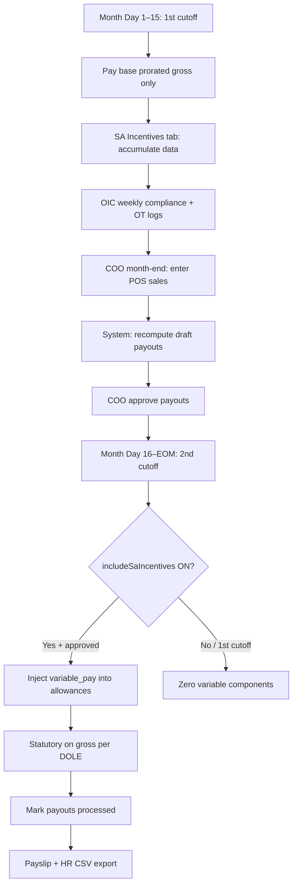

# SA Incentives — EOM Integration Plan (MVP)

**Sources:** `POGRC-HRMS-PAYROLL-IMPLEMENTATION-PLAN.md` · `SAincentives.md` (v2.0, June 2026)  
**Interpretation:** **EOD = EOM** — all variable SA pay (commission, OT, compliance cash, store goal) runs **only on the 2nd cutoff / end-of-month** payroll. Mid-month (1st cutoff) pays **base salary + statutory only** for SA track employees.

**Approach (Karpathy):** Pure policy + math in `src/lib/*` first → bridge into payroll issue → UI surfaces rules → tests lock behavior. No new framework.

---

## 1. Assumptions

| Topic | Decision |
|-------|----------|
| EOD meaning | **End of month (EOM)**, 2nd semi-monthly cutoff per `SAincentives.md` |
| SA base pay | ₱15,340/mo fixed (`SA_BASE_SALARY`); 1st cutoff = half base prorated via existing gross logic |
| Variable pay window | Day 1 → last calendar day of month (accumulate in SA Incentives tab; **pay** on EOM run only) |
| Approval gate | `draft` → `approved` (COO/Board) → `processed` (HR payroll export) — unchanged |
| Store goal | Additional to ₱21,452.50 cap; pool ₱10,000 when branch ≥ ₱6M |
| Roles (MVP) | COO = `admin`; OIC = `supervisor`; HR = `finance` / `payroll_admin`; SA = `employee` read-only (Phase 2b) |

---

## 2. Current State vs Spec

| Capability | Spec (`SAincentives.md`) | Code today | MVP target |
|------------|--------------------------|------------|------------|
| Sales commission tiers | Flat tier, ₱0–₱2,000 | ✅ `computeSalesCommission` | Keep |
| OT daily cap 2h | ✅ | ✅ `capOtHoursForDay` | Keep |
| OT monthly cap 24h | ✅ Max ₱2,212.50 | ❌ Missing | **MVP-1** |
| Compliance 0–360 floor | ✅ | ✅ | Keep |
| Store goal ₱6M gate | ✅ | ✅ | Keep |
| EOM-only variable pay | **Critical** | ❌ Applies any cutoff | **MVP-1** |
| Bulk payroll SA preview | — | ✅ Toggle + totals | Wire EOM gate |
| Payslip bridge | Approved → allowances | ✅ `getApprovedSaIncentiveAllowances` | EOM gate |
| Max cash (excl. store goal) | Base + variable ≤ ₱21,452.50 | ❌ | **MVP-2** warn in UI |
| Weekly compliance entry | Per week × 4 | Partial (monthly aggregate) | Phase 2 |
| OT approval + cash/offset | Pre-approved log | Partial (hours array) | Phase 2 |
| Non-cash GC/rice tracking | Separate from cash payroll | Notes + CSV export | Phase 2 |
| SA self-service view | Read-only own payout | ❌ | Phase 2 |
| POS import | Validation | ❌ | Phase 4 |

---

## 3. EOM Payroll Workflow (Target)



### 3.1 Cutoff rules (enforced in code)

| `payFrequency` | SA variable pay allowed when |
|----------------|------------------------------|
| `semi_monthly` | `cutoff === "second"` only |
| `monthly` | Always (single run = EOM) |
| `weekly` / `bi_weekly` | Never via SA bridge (use HR manual until SA track extended) |

### 3.2 Payslip field mapping

| Spec type | Component | Payslip / notes |
|-----------|-----------|-----------------|
| `fixed_pay` | Base ₱15,340 (or prorated gross) | `grossPay` |
| `variable_pay` | Commission + OT cash + compliance cash + store goal | `allowances` via bridge |
| `non_cash_gc` | Compliance GC | Payslip note + CSV `non_cash` |
| `non_cash_kind` | Rice / token | Payslip note + HR handoff |

---

## 4. MVP Implementation Phases

### Phase MVP-1 — EOM gate + OT monthly cap (this delivery)

**Goal:** System cannot pay SA variable components on 1st cutoff.

| Task | File |
|------|------|
| Cutoff eligibility helper | `src/lib/sa-eom-policy.ts` |
| 24h/month OT cap | `src/lib/sa-commission.ts` → `computeSaOtPay` |
| Bridge respects cutoff | `src/lib/sa-payroll-bridge.ts` |
| Bulk modal: disable SA on 1st cutoff, show EOM banner | `bulk-payroll-sa-incentives.tsx`, `admin-view.tsx` |
| SA tab: EOM processing checklist | `sa-commission-panel.tsx` |
| Unit tests | `sa-eom-policy.test.ts`, update `sa-commission` / `sa-payroll-bridge` tests |

**Verify:**

```bash
npm test -- sa-eom sa-payroll-bridge sa-commission
```

- 1st cutoff + approved payout → allowance **₱0**, reason `EOM only`
- 2nd cutoff + approved → allowance **> 0**
- OT `[3,3,...,3]` (15 days) → capped at **24h × ₱92.19**

### Phase MVP-2 — Caps, totals, payslip clarity

| Task | Detail |
|------|--------|
| Variable cap warning | If commission+OT+compliance cash > ₱6,112.50, show amber banner (excludes store goal) |
| Payslip line items | Optional `lineItemsJson` rows: Sales / OT / Compliance / Store Goal |
| EOM lock flag | After `processed`, block edits unless admin override |

### Phase 2 — Operational UI (from implementation plan)

| Task | Detail |
|------|--------|
| Weekly compliance grid | 4 weeks × earn/deduct fields → `sa_compliance_weeks` |
| OT approval modal | Date, hours, cash\|offset, approver → `sa_ot_approvals` |
| SA employee view | `/employee/sa-incentives` read-only approved breakdown |
| OIC branch scope | Filter by supervisor branch |

### Phase 3 — Reports (6 outputs)

1. Monthly Payout Report  
2. Compliance Score Card  
3. KPI Ranking Board  
4. OT Summary  
5. Store Goal Dashboard  
6. SA Self-Service (employee)

### Phase 4 — POS & integrity

- POS sales import / validation flags  
- `highest_sales_wins` unique per branch/week at DB  
- Break-through-break → paid hours (timesheet integration)

---

## 5. Role Matrix (EOM month)

| Step | Actor | UI location |
|------|-------|-------------|
| Weekly compliance | OIC | SA Incentives → Compliance (Phase 2: per-week) |
| Friday validation | COO | SA Incentives → Review |
| OT approve + cash/offset | OIC/COO | SA Incentives → OT (Phase 2) |
| Month-end POS sales | COO | SA Incentives → Branch sales |
| Recompute + approve | COO | SA Incentives → Approve |
| EOM payroll run | HR/Admin | Run Payroll → **2nd cutoff** → SA toggle ON |
| Export | HR | SA Incentives → Export CSV + payslip batch |

---

## 6. Sample Month Test (Kim — `SAincentives.md` § Sample)

| Component | Amount | Check |
|-----------|--------|-------|
| Base | ₱15,340 | 1st cutoff ≈ half; 2nd includes remainder + variable |
| Sales commission | ₱1,500 | EXCELLENT @ ₱1.25M |
| OT | ₱2,212.50 | 24h cap |
| Compliance cash | ₱1,000 | GOLD 290 pts |
| GC + rice | ₱900 | Non-cash notes only |
| Store goal | Variable | Branch ≥ ₱6M |

**EOM cash variable (excl. store goal):** ₱1,500 + ₱2,212.50 + ₱1,000 = **₱4,712.50**  
**With base on full EOM run:** ₱20,052.50 + store goal share

---

## 7. File Map (after MVP-1)

| File | Role |
|------|------|
| `src/lib/sa-commission.ts` | Pure math (single source of truth) |
| `src/lib/sa-eom-policy.ts` | EOM cutoff + cap constants |
| `src/lib/sa-payroll-bridge.ts` | Approved → payslip allowances |
| `src/store/sa-commission.store.ts` | Cycles, draft/approve/processed |
| `src/components/payroll/sa-commission-panel.tsx` | COO/OIC data entry |
| `src/components/payroll/bulk-payroll-sa-incentives.tsx` | Run Payroll SA block |
| `src/app/[role]/payroll/_views/admin-view.tsx` | Issue payslip + cutoff |
| `supabase/migrations/062_sa_commission.sql` | Persistence |

---

## 8. Success Criteria (MVP done when)

- [x] 1st cutoff never injects SA variable allowances (automated test)
- [x] 2nd cutoff injects approved SA totals (automated test)
- [x] OT monthly cap 24h enforced (automated test)
- [x] Bulk payroll UI shows EOM-only messaging and disables toggle on 1st cutoff
- [x] SA Incentives tab documents EOM workflow steps
- [x] Existing Jest tests remain green (729 passing)
- [x] `npm run build` passes

---

© Premium Outlets Global Retail Corp. — internal EOM integration plan v1.0
