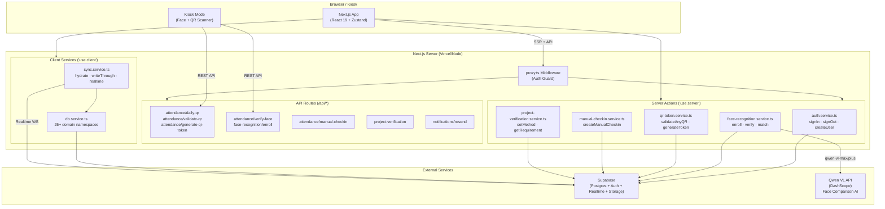
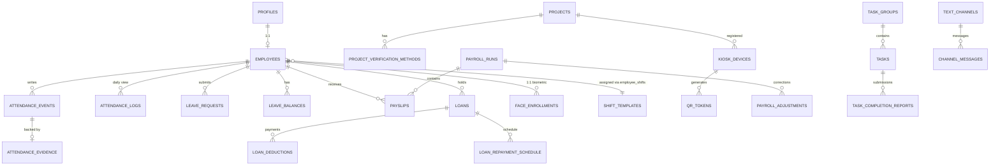
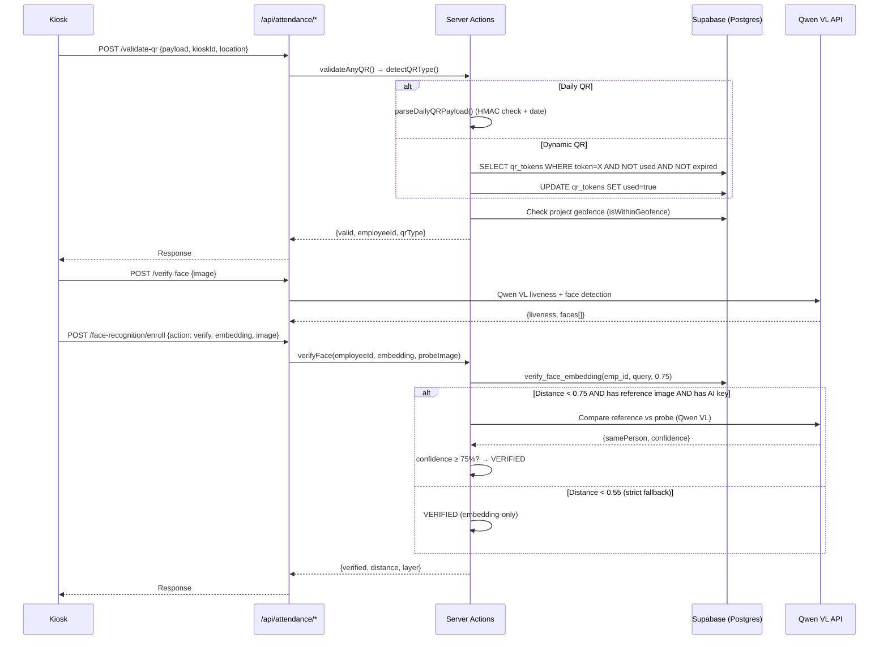
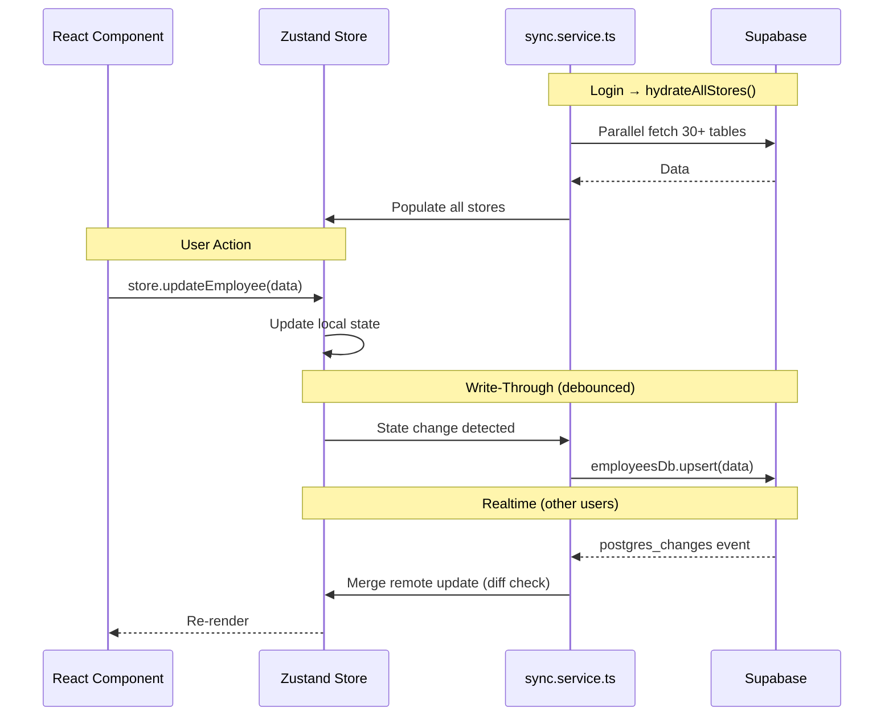

# NexHRMS — Backend Architecture Document

> **Version**: 1.1 · **Last Audited**: 2026-03-30  
> **Stack**: Next.js 16 (App Router) · Supabase (Postgres + Auth + Realtime) · Zustand · TypeScript 5

---

## 1. Architecture Principles

1. **Security by Design** — RLS at database layer, HMAC-signed tokens, timing-safe comparisons, dual-layer biometric verification.
2. **Simplicity over Microservices** — Single Next.js deployment with domain-separated service modules. No premature decomposition.
3. **Event-Sourced Attendance** — Append-only `attendance_events` ledger with computed `attendance_logs` views. Immutable audit trail.
4. **Offline-First Client** — Zustand stores hydrated from Supabase, synced via write-through + Postgres realtime subscriptions.
5. **API-First for Kiosk** — RESTful API routes for device-facing operations (QR, face recognition). Server Actions for web-facing mutations.

---

## 2. Architecture Diagram



---

## 3. Domain Boundaries

| Domain | Service Module | Store | DB Tables | Owner |
|--------|---------------|-------|-----------|-------|
| **Identity** | `auth.service.ts` | `auth.store.ts` | `profiles`, Supabase `auth.users` | System |
| **Workforce** | `db.service.ts` (employeesDb) | `employees.store.ts` | `employees`, `salary_change_requests`, `salary_history` | HR/Admin |
| **Attendance** | `db.service.ts` (attendanceDb) | `attendance.store.ts` | `attendance_events`, `attendance_logs`, `attendance_evidence`, `attendance_exceptions`, `shift_templates`, `employee_shifts`, `holidays`, `overtime_requests`, `penalty_records`, `break_records` | System/Admin |
| **Biometrics** | `face-recognition.service.ts` | — | `face_enrollments` | System |
| **QR Tokens** | `qr-token.service.ts`, `qr-utils.ts` | `kiosk.store.ts` | `qr_tokens`, `kiosk_devices` | System |
| **Leave** | `db.service.ts` (leaveDb) | `leave.store.ts` | `leave_requests`, `leave_balances`, `leave_policies` | HR/Admin |
| **Payroll** | `db.service.ts` (payrollDb) | `payroll.store.ts` | `payslips`, `payroll_runs`, `payroll_adjustments`, `final_pay_computations`, `pay_schedule_config` | Finance/Admin |
| **Loans** | `db.service.ts` (loansDb) | `loans.store.ts` | `loans`, `loan_deductions`, `loan_repayment_schedule` | Finance/Admin |
| **Projects** | `db.service.ts` (projectsDb), `project-verification.service.ts` | `projects.store.ts` | `projects`, `project_verification_methods` | Admin |
| **Timesheets** | `db.service.ts` (timesheetsDb) | `timesheet.store.ts` | `timesheets`, `attendance_rule_sets` | HR/Admin |
| **Tasks** | `db.service.ts` (tasksDb) | `tasks.store.ts` | `task_groups`, `tasks`, `task_completion_reports`, `task_comments` | PM/Admin |
| **Messaging** | `db.service.ts` (messagingDb) | `messaging.store.ts` | `announcements`, `text_channels`, `channel_messages` | All |
| **Location** | `geofence.ts`, `db.service.ts` (locationDb) | `location.store.ts` | `location_pings`, `site_survey_photos` | System |
| **Audit** | `db.service.ts` (auditDb) | `audit.store.ts` | `audit_logs` | System (immutable) |
| **Notifications** | `db.service.ts` (notificationsDb) | `notifications.store.ts` | `notification_logs`, `notification_rules` | System/Admin |

---

## 4. API Specification

### 4.1 Attendance — QR Endpoints

| Method | Route | Auth | Request Body | Response | Notes |
|--------|-------|------|-------------|----------|-------|
| `GET` | `/api/attendance/daily-qr?employeeId=X` | Cookie (user) | — | `{ payload: string }` | HMAC-signed, rotates at midnight |
| `POST` | `/api/attendance/validate-qr` | None (kiosk) | `{ payload, kioskId, location? }` | `{ ok, valid, employeeId, qrType, message }` | Universal: daily/static/dynamic |
| `POST` | `/api/attendance/generate-qr-token` | None (kiosk) | `{ employeeId, deviceId }` | `{ ok, token, expiresAt }` | 30-sec single-use dynamic token |

### 4.2 Attendance — Face Recognition

| Method | Route | Auth | Request Body | Response | Notes |
|--------|-------|------|-------------|----------|-------|
| `POST` | `/api/attendance/verify-face` | None (kiosk) | `{ image: base64 }` | `{ liveness, faces[] }` | Qwen VL liveness + face detection |
| `POST` | `/api/face-recognition/enroll` | Mixed | `{ action, employeeId, embedding?, image? }` | Varies by action | Actions: enroll/verify/match/delete |
| `GET` | `/api/face-recognition/enroll?employeeId=X` | Cookie | — | `{ enrolled, enrollmentDate }` | Check enrollment status |

### 4.3 Attendance — Manual Override

| Method | Route | Auth | Request Body | Response | Notes |
|--------|-------|------|-------------|----------|-------|
| `POST` | `/api/attendance/manual-checkin` | Cookie (admin/hr) | `{ employeeId, eventType, reasonId, notes? }` | `{ ok, checkin }` | Creates event + audit log |
| `GET` | `/api/attendance/manual-checkin` | Cookie (admin/hr) | — | `{ reasons[] }` | Active reason options |

### 4.4 Project Verification

| Method | Route | Auth | Request Body | Response | Notes |
|--------|-------|------|-------------|----------|-------|
| `GET` | `/api/project-verification?projectId=X` | Cookie | — | `{ method, requireGeofence, radius }` | Per-project or list all |
| `POST` | `/api/project-verification` | Cookie (admin) | `{ projectId, method, options? }` | `{ ok }` | face_only/qr_only/face_or_qr/manual_only |

### 4.5 Notifications

| Method | Route | Auth | Request Body | Response | Notes |
|--------|-------|------|-------------|----------|-------|
| `POST` | `/api/notifications/resend` | Cookie/demo | `{ type, targetEmployeeIds? }` | `{ ok, sent }` | Trigger assignment/absence alerts |

---

## 5. Database Schema

### 5.1 Entity-Relationship Overview



### 5.2 Core Tables (27 Migrations)

| Table | PK | Key Columns | RLS | Purpose |
|-------|-----|-------------|-----|---------|
| `profiles` | `id` (FK → auth.users) | name, role, avatar_url, must_change_password | Yes | User account metadata |
| `employees` | `id` | profile_id, name, email, role, department, status, salary, pin, nfc_id, shift_id | Yes | Employee roster |
| `attendance_events` | `id` | employee_id, event_type (ENUM 22 values), timestamp_utc, device_id, performed_by | Yes | **Append-only event ledger** |
| `attendance_logs` | `id` | employee_id, date, check_in/out, hours, status, project_id, location_lat/lng, flags | Yes | Computed daily summary |
| `attendance_evidence` | `id` | event_id, gps_lat/lng, geofence_pass, qr_token_id, face_verified | Yes | Supporting proof |
| `attendance_exceptions` | `id` | employee_id, date, flag (ENUM 6 values), auto_generated, resolved_by | Yes | Flagging system |
| `shift_templates` | `id` | name, start_time, end_time, grace_period, break_duration, work_days[] | Yes | Shift definitions |
| `employee_shifts` | `employee_id` | shift_id | Yes | 1:1 junction |
| `holidays` | `id` | date, name, type (regular/special), multiplier | Yes | PH DOLE holidays |
| `overtime_requests` | `id` | employee_id, date, hours_requested, status, reviewed_by | Yes | OT approval flow |
| `leave_requests` | `id` | employee_id, type (SL/VL/EL/ML/PL/SPL), start/end_date, status | Yes | Leave approval |
| `leave_balances` | `id` | employee_id, leave_type, year, entitled, used, carried_forward, remaining | Yes | Annual entitlements |
| `leave_policies` | `id` | leave_type, accrual_frequency, annual_entitlement, max_balance, expiry_months | Yes | Leave config |
| `payslips` | `id` | employee_id, period_start/end, gross_pay, sss/philhealth/pagibig/tax, net_pay, status | Yes | Issued payslips |
| `payroll_runs` | `id` | period_label, status (draft→validated→locked→published→paid), payslip_ids (JSONB), policy_snapshot | Yes | Batch lifecycle |
| `payroll_adjustments` | `id` | payroll_run_id, employee_id, adjustment_type, amount, status | Yes | Corrections |
| `final_pay_computations` | `id` | employee_id, resigned_at, pro_rated_salary, unpaid_ot, leave_payout, loan_balance, net_final_pay | Yes | Resignation settlement |
| `loans` | `id` | employee_id, type, amount, remaining_balance, monthly_deduction, status, approved_by | Yes | Loan records |
| `loan_deductions` | `id` | loan_id, payslip_id, amount, deducted_at | Yes | Deduction history |
| `projects` | `id` | name, location_lat/lng/radius, assigned_employee_ids[], verification_method, require_geofence | Yes | Project config with geofencing |
| `project_verification_methods` | `id` | project_id (UK), verification_method, require_geofence, geofence_radius_meters, allow_manual_override | Yes | Per-project verification |
| `kiosk_devices` | `id` | name, project_id, is_active | Yes | Registered kiosks |
| `qr_tokens` | `id` | device_id, employee_id, token, expires_at (30s), used, used_at, used_by_kiosk_id | Yes | Ephemeral dynamic tokens |
| `face_enrollments` | `id` | employee_id, embedding (JSONB 128-d), reference_image (base64), is_active, enrolled_by | Yes | Biometric data |
| `manual_checkins` | `id` | employee_id, event_type, reason_id, performed_by, timestamp_utc, project_id | Yes | Admin overrides |
| `audit_logs` | `id` | entity_type, entity_id, action (ENUM 40+), performed_by, before/after_snapshot (JSONB) | Yes | **Immutable audit trail** |
| `timesheets` | `id` | employee_id, date, rule_set_id, regular/overtime/night_diff_hours, segments (JSONB), status | Yes | Daily timesheet |
| `notification_logs` | `id` | employee_id, type, channel, subject, body, sent_at, status | Yes | Sent notifications |
| `payroll_run_payslips` | `(run_id, payslip_id)` | run_id (FK), payslip_id (FK), added_at | Yes | **Junction: payroll run ↔ payslips** (migration 028) |
| `project_assignments` | `(project_id, employee_id)` | project_id (FK), employee_id (FK), assigned_at | Yes | **Junction: project ↔ employees** (migration 029) |

### 5.3 Database Functions (Postgres)

| Function | Trigger? | Purpose |
|----------|----------|---------|
| `match_face_embedding(query, threshold=0.75)` | No | 1:N Euclidean distance search across all enrollments |
| `verify_face_embedding(emp_id, query, threshold=0.75)` | No | 1:1 verification + updates last_verified/verification_count |
| `enforce_one_project_per_employee()` | Yes (BEFORE INSERT on project_assignments) | Atomic: removes employee from OTHER projects when assigned |

---

## 6. Security Model

### 6.1 Authentication Layers

| Layer | Mechanism | Where |
|-------|-----------|-------|
| **Browser Auth** | Supabase Auth (email/password) → httpOnly cookie | `auth.service.ts`, `supabase-server.ts` |
| **Middleware Guard** | `proxy.ts` — verifies cookie on every request | All routes except /login, /kiosk, static assets |
| **RLS (Row-Level Security)** | Postgres policies per table, per role | Database layer — enforced regardless of client |
| **Admin Bypass** | Service Role Key (server-side only) | `createAdminSupabaseClient()` for system operations |
| **Rate Limiting** | In-memory sliding window (60 req/min per IP) | `rate-limit.ts` → kiosk API routes |
| **Kiosk Device Auth** | API key via `X-Kiosk-Api-Key` header, timing-safe comparison | `kiosk-auth.ts` → kiosk API routes |
| **Demo Mode** | `NEXT_PUBLIC_DEMO_MODE=true` → skip Supabase, use localStorage auth | Development/demo only |

### 6.2 Kiosk Security

| Threat | Mitigation |
|--------|------------|
| QR replay attack | Daily QR rotates at midnight; dynamic QR auto-expires in 30 seconds |
| QR forgery | HMAC-SHA256 signature via Web Crypto; timing-safe comparison prevents side-channel |
| Face spoofing | Dual-layer: embedding distance pre-filter (0.75) → Qwen VL AI confirmation (≥75% confidence) |
| GPS spoofing | `attendance_evidence.mock_location_detected`, geofence validation via Haversine |
| Rapid-fire abuse | In-memory rate limiting (60 req/min per IP) via `rate-limit.ts`; `penalty_records` table with cooldown periods |
| Unauthorized device | `X-Kiosk-Api-Key` header validated via `kiosk-auth.ts` with timing-safe comparison |

### 6.3 Security Headers (next.config.ts)

```
X-Frame-Options: DENY
X-Content-Type-Options: nosniff
Strict-Transport-Security: max-age=63072000; includeSubDomains; preload
Content-Security-Policy: default-src 'self'; connect-src *.supabase.co dashscope.aliyuncs.com; frame-ancestors 'none'
Permissions-Policy: camera=(self), microphone=(), geolocation=(self)
```

### 6.4 Environment Variables

| Variable | Scope | Required | Purpose |
|----------|-------|----------|---------|
| `NEXT_PUBLIC_SUPABASE_URL` | Client+Server | Yes (unless demo) | Supabase project URL |
| `NEXT_PUBLIC_SUPABASE_ANON_KEY` | Client+Server | Yes (unless demo) | Supabase anon key (RLS-enforced) |
| `SUPABASE_SERVICE_ROLE_KEY` | Server only | Yes (unless demo) | Admin operations (bypasses RLS) |
| `QWEN_API_KEY` | Server only | Optional | DashScope API for face AI |
| `QWEN_MODEL` | Server only | Optional | Override model (default: vl-max prod / vl-plus dev) |
| `DASHSCOPE_BASE_URL` | Server only | Optional | Custom DashScope endpoint |
| `QR_HMAC_SECRET` | Server+Client | Optional (warns if missing) | HMAC key for QR signatures |
| `FACE_TEMPLATE_ENCRYPTION_KEY` | Server only | Optional (warns if missing) | Face template encryption |
| `KIOSK_API_KEY` | Server only | Optional (warns if missing) | API key for kiosk device authentication |
| `NEXT_PUBLIC_DEMO_MODE` | Client+Server | Optional | Enable demo mode (skip Supabase) |

---

## 7. Data Flow Patterns

### 7.1 Check-In Flow (Kiosk)



### 7.2 Store Sync Flow (Browser)



### 7.3 Payroll Run Lifecycle

```
DRAFT → VALIDATED → LOCKED → PUBLISHED → PAID
  │         │          │          │          │
  └─ Create └─ Validate └─ Freeze └─ Issue  └─ Mark paid
     payslips  deductions  edits    payslips   (final)
               (SSS/PH/    blocked
               PAGIBIG/tax)
```

---

## 8. Technology Stack

| Layer | Technology | Rationale |
|-------|-----------|-----------|
| **Runtime** | Next.js 16.1.6 (App Router + Turbopack) | Server Actions, SSR, API routes, middleware — single deployment |
| **Language** | TypeScript 5 | Type safety across full stack |
| **UI Framework** | React 19.2.3 + Tailwind CSS 4 | Server components, streaming, modern CSS |
| **State** | Zustand 5 | Lightweight, no boilerplate, persist middleware for offline |
| **Database** | Supabase (PostgreSQL) | RLS, Auth, Realtime subscriptions, Edge Functions |
| **Auth** | Supabase Auth (SSR) | httpOnly cookies, email/password, role in profiles |
| **AI** | Qwen VL (DashScope) | Face comparison + liveness detection |
| **Face Detection** | @vladmandic/face-api (SSD MobileNet) | Client-side 128-d embedding extraction |
| **Maps** | Leaflet + React-Leaflet + OSM tiles | Geofencing visualization, no API key needed |
| **QR** | qrcode.react + custom HMAC utils | Employee QR display + generation |
| **Forms** | React Hook Form + Zod 4 | Schema validation, controlled forms |
| **Charts** | Recharts 3 | Dashboard analytics |
| **Testing** | Jest 30 + ts-jest + jsdom | 460 tests, <4s runtime |
| **Components** | Radix UI + shadcn/ui + CVA | Accessible, composable UI primitives |

---

## 9. Deployment Strategy

### 9.1 Infrastructure

```
┌─────────────────────────────────────────┐
│ Vercel (or any Node.js host)            │
│ ┌─────────────────────────────────────┐ │
│ │ Next.js 16 (single deployment)      │ │
│ │ • SSR pages + API routes            │ │
│ │ • Server Actions                    │ │
│ │ • Middleware (auth guard)           │ │
│ │ • Static assets (face models, etc)  │ │
│ └─────────────────────────────────────┘ │
└───────────────┬─────────────────────────┘
                │ HTTPS
┌───────────────▼─────────────────────────┐
│ Supabase (managed)                      │
│ • PostgreSQL (RLS-enabled)              │
│ • Auth (email/password + JWT)           │
│ • Realtime (WebSocket subscriptions)    │
│ • Storage (if needed for file uploads)  │
└───────────────┬─────────────────────────┘
                │ HTTPS
┌───────────────▼─────────────────────────┐
│ DashScope (managed)                     │
│ • Qwen VL face comparison API          │
│ • No self-hosting required             │
└─────────────────────────────────────────┘
```

### 9.2 CI/CD Pipeline

```
1. Push to main/develop
   ├─ Lint: eslint
   ├─ Type-check: tsc --noEmit
   ├─ Test: jest (460 tests)
   └─ Build: next build

2. Preview (PR)
   └─ Vercel preview deployment (auto)

3. Production (merge to main)
   ├─ Vercel production deployment
   └─ Supabase migration: supabase db push
```

### 9.3 Scaling Considerations

| Concern | Current Approach | Future Path |
|---------|-----------------|-------------|
| **Concurrent users** | Single Next.js instance, Supabase connection pooling | Vercel auto-scaling, Supabase connection pooler (PgBouncer) |
| **Face search** | `match_face_embedding()` linear scan | Add pgvector extension for ANN (approximate nearest neighbor) |
| **QR token cleanup** | Manual `cleanupExpiredTokens()` | Supabase cron job (pg_cron) or Edge Function |
| **Realtime subscriptions** | All tables subscribed per client | Selective per-role subscription, Supabase multiplexing |
| **Large payroll runs** | Client-side computation | Move to Edge Function or background job |
| **File storage** | base64 in DB (face images) | Migrate to Supabase Storage (S3) for images >100KB |

---

## 10. Architectural Concerns & Recommendations

### CRITICAL

| # | Concern | Impact | Status |
|---|---------|--------|--------|
| 1 | **Face images stored as base64 in DB** | `face_enrollments.reference_image` is ~50-200KB per employee. Bloats DB, slows queries, increases backup size. | **OPEN** — Migrate to Supabase Storage; store URL in DB column. |
| 2 | ~~**No rate limiting on kiosk API routes**~~ | ~~Vulnerable to brute-force.~~ | **FIXED** — `rate-limit.ts` sliding window (60 req/min per IP) applied to all kiosk routes. |
| 3 | ~~**`payslip_ids` as JSONB array in `payroll_runs`**~~ | ~~Breaks referential integrity.~~ | **FIXED** — Migration 028: `payroll_run_payslips(run_id, payslip_id)` junction table with FK constraints. Legacy column kept during transition. |

### HIGH

| # | Concern | Impact | Status |
|---|---------|--------|--------|
| 4 | ~~**Kiosk API endpoints have no device authentication**~~ | ~~Any HTTP client can call kiosk routes.~~ | **FIXED** — `kiosk-auth.ts` validates `X-Kiosk-Api-Key` header with timing-safe comparison. Skips in demo/dev mode. |
| 5 | ~~**`assigned_employee_ids` as text[] in projects**~~ | ~~No FK enforcement, no index.~~ | **FIXED** — Migration 029: `project_assignments(project_id, employee_id)` junction table. Trigger moved to junction table. |
| 6 | **Linear face embedding search** | `match_face_embedding()` scans all rows. At 1000+ employees, latency grows. | **OPEN** — Install `pgvector` extension, use `ivfflat` or `hnsw` index. |
| 7 | **No background job system** | Token cleanup, payroll computation, notification dispatch all run inline. | **OPEN** — Add pg_cron for scheduled tasks, or Supabase Edge Functions for async work. |

### MEDIUM

| # | Concern | Impact | Recommendation |
|---|---------|--------|----------------|
| 8 | **Sync service subscribes to ALL tables for ALL users** | Bandwidth waste — employees receive admin-only table changes. | Scope realtime subscriptions by role. |
| 9 | **No API versioning** | Breaking changes to kiosk API require simultaneous kiosk+server deploys. | Add `/api/v1/` prefix for kiosk-facing routes. |
| 10 | **`read_by` as text[] in announcements** | Same array-column anti-pattern as projects. | Normalize to `announcement_reads(announcement_id, employee_id, read_at)`. |

---

## 11. Testing Coverage

| Domain | Suite | Tests | Coverage |
|--------|-------|-------|----------|
| Face Recognition | `face-recognition.test.ts` | 50 | Thresholds (0.75/0.55/75%), dual-layer logic, 1:N matching, edge cases |
| QR Utilities | `qr-utils.test.ts` | 36 | HMAC generation/parsing, tamper detection, type classification |
| Geofence | `geofence.test.ts` | 15 | Haversine distance, boundary conditions, hemispheres |
| QR Validation | `qr-validation.test.ts` | 16 | Service dispatch, daily/static/dynamic validation, mock Supabase |
| Rate Limiting | `rate-limit.test.ts` | 13 | Sliding window, burst blocking, expiry, multi-key isolation, IP extraction |
| Kiosk Auth | `kiosk-auth.test.ts` | 8 | Demo bypass, missing key, wrong key, matching key, special chars |
| Zustand Stores | 12 store test suites | 322 | State mutations, PH deductions, payroll computation |
| **Total** | **19 suites** | **460** | **stores + lib + security covered; services need integration tests** |

### Testing Gaps

- No E2E tests (Playwright/Cypress)
- No API route integration tests (supertest)
- No load testing for kiosk endpoints
- Store tests are self-contained simulations (don't import real services)

---

## 12. Conventions for New Backend Work

### Adding a New API Route
```
src/app/api/<domain>/<action>/route.ts
├─ Export named functions: GET, POST, PUT, DELETE
├─ Parse request body with Zod schema
├─ Call into service layer (never query DB directly)
├─ For kiosk routes: add rate limiting (kioskRateLimiter) + kiosk auth (validateKioskAuth)
├─ Return NextResponse.json()
└─ Add to this document's §4 API Specification
```

### Adding a New Service
```
src/services/<domain>.service.ts
├─ Add "use server" directive for server actions
├─ Use createServerSupabaseClient() for user-scoped ops
├─ Use createAdminSupabaseClient() for system ops
├─ Use db-mappers.ts for snake_case ↔ camelCase
├─ Add corresponding store + sync integration
└─ Add to this document's §3 Domain Boundaries
```

### Adding a New DB Table
```
supabase/migrations/0XX_<description>.sql
├─ CREATE TABLE with appropriate types and constraints
├─ ADD RLS policies (admin read all, employees read own)
├─ Add to db.service.ts domain namespace
├─ Add to sync.service.ts hydration + realtime
├─ Add TypeScript interface to types/index.ts
└─ Update this document's §5 Database Schema
```

### Adding a New Store
```
src/store/<domain>.store.ts
├─ Zustand create() with typed state + actions
├─ Domain-specific mutations (never call DB directly — sync handles it)
├─ Add hydrate function called by sync.service.ts
├─ Add to sync write-through subscriptions
└─ Add realtime subscription if needed
```
